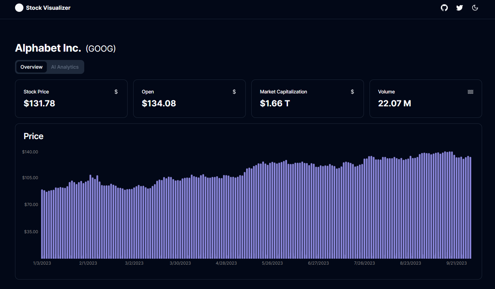

# Stock Visualizer
A very simple app to visualize stock data, you can find it [here](https://stock-visualizer-arthurverrez.vercel.app/).

> **Warning**
> This app is a work in progress, it is more of a proof of concept than a fully functional app.

## About this project

This project is an experiment to try and visualize stock data in a more intuitive way. While it is still in its infancy stage of building core functionalities and features, the goal here is to be able to add AI analytics to the data to help users make better decisions.

### Motivation
With the current rise of LLMs, the ability to correlate pure financial data and news articles is becoming more and more important. This project is an attempt to build a tool that can help with that.

## Technologies
This project is built using the following technologies:
- [React](https://reactjs.org/)
- [Next.js 13](https://nextjs.org/blog/next-13)
- [Tailwind CSS](https://tailwindcss.com/)
- [Yahoo Finance](https://finance.yahoo.com/)
- [shadcn-ui](https://github.com/shadcn-ui/ui)
- Deployed on [Vercel](https://vercel.com/)

## Issues

There currently is an issue with the [yahoo-finance-2](https://github.com/gadicc/node-yahoo-finance2) module that is used to fetch stock data. The issue is that the module is not fully compatible with Next.js 13, for more information you can check out the issue [here](https://github.com/gadicc/node-yahoo-finance2/issues/645).

That explains the *weird* build script in the `package.json` file.